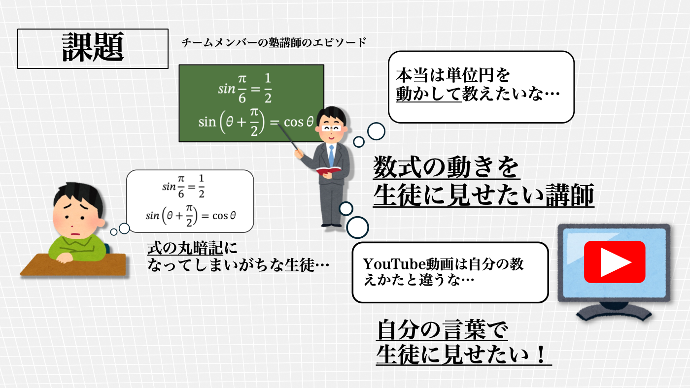

# SUDO - スウガクドウガ -

## 製品概要

**数学教育 X Tech**: 生徒に数式の"動き"を伝えたい数学講師が、即座にオリジナル解説動画を作れる動画ジェネレーター

### 背景（製品開発のきっかけ、課題等）

塾の数学の講師をしている中で、数式の意味を教えたいのに生徒が数式の意味を丸暗記してしまい、式の意味を理解していない生徒をたくさん見てきました。そこで私のような
  - **学校や塾の数学講師、「自分らしい解説」を動画で手軽に届けたい先生**
  が簡単に副教材としてのアニメーションを作れるアプリケーションを作りたいと考えました！
#### 課題感
<!-- ここにスライド貼り付け -->

<!-- youtube動画 -->
#### 紹介動画

<video src="https://youtu.be/iyhTQFKciaY" controls="true"></video>

#### 生成可能な動画

<video src="https://www.youtube.com/watch?v=XEERMwexpYI" controls="true"></video>

#### 課題の裏付け

- **生徒の課題**
  - 数学の公式や答えばかりを暗記し、数式の意味や“なぜそうなるか”を理解できていない。
  - **エビデンス**：2025年度全国学力テストでは、中学数学「図形証明」問題の無解答率が31.2%に上り、「途中過程や根拠」の説明に苦労する生徒が多いことが報告されている。[【全国学力テスト】数学の図形証明は無解答率3割超、大きな男女差なし](https://reseed.resemom.jp/article/2025/07/31/11410.html)

- **数学講師の課題**
  - 生徒に本質的なイメージや根拠をつかんでもらうために工夫したいが、動きや直感を伝える教材が限られ、動画教材を自作するには多大な負担と専門知識が必要。
  - **実際の現場エピソード**：チームメンバー（塾講師）が、生徒は「三角関数を教える際、多くの生徒が `sin30°=1/2` など“答えの暗記”に留まり、本質的なイメージ（例：単位円）や根拠を伝えきれない」ことに気づいた。

#### 従来教材・動画教材の限界

- 紙のプリントや黒板、静止画像教材では、図形の変形や関数の動きを直感的に伝えられない。
- YouTube動画教材は生徒にとっての「その場」の疑問とずれていることもある。
  - また講師が本当に教えたい内容や重点と違う場面が多々あり、指導現場でも不適切なケースが発生しやすい。

- また、[スタディサプリの学習塾市場から撤退](https://www.shijyukukai.jp/2025/09/28730)が示すように動画教材が「サービス自体のカスタマイズ性不足」「塾ごとの指導方針やカリキュラムに柔軟に対応できない」という課題が学習市場である。
- 加えて**現在の動画生成AIツールでは、教育用・数学専用のアニメーション、数式変形の過程や根拠を表現する細かなカスタマイズが難しく、現場の課題にフィットしない。**
- つまり「動的な可視化」と「細やかな個別カスタマイズ」を同時に実現する“教育現場で使用できるツール”が決定的に不足している。

#### 解決の方向性

- **「公式や答えの暗記」で終わってしまう生徒に、数式や関数・図形の“動き”や“なぜそうなるか”の根拠をアニメーション動画で直感的に伝えられるようにする。**
- **教師・塾講師が、生徒ごと・授業ごとの“その場”の疑問や理解度に合わせて、オリジナルの解説動画を簡単・即時に作れるようにする。**
- **AIとmanimによる自動生成・編集機能で、従来は専門知識や長時間が必要だった教材（動画）作成のハードルを劇的に下げる。**
- **動画生成・編集の工程をすべて直感的なUIで完結させ、誰でも現場のニーズに合わせた数学教材を手軽に作れる環境を提供する。**

### 製品説明（具体的な製品の説明）

#### ひとことで
- **SUDO**は、数学講師のための「公式の暗記」で終わらず、“なぜそうなる？”まで先生の言葉で直感的に伝えられる**AI数学動画ジェネレーター**です。

#### ポイント解説

### 特長

- **誰のため？**
  - 学校や塾の数学講師、「自分らしい解説」を動画で手軽に届けたい先生
- **何ができる？**
  - 手元の数式や板書イメージをテキストで入力すれば、**AI×manimが解説意図に沿った理想の数学動画を即自動生成**
  - 先生自身の“教えたい順序”“強調したいポイント”“生徒のつまずきや質問”を、自然な日本語で柔軟に動画へ反映できる

- **どう使える？**
  - 授業で「説明が難しい」「紙だと伝わらない」単元を、すぐ動画でビジュアル化
  - テスト後や質問対応で、生徒ごとに「分からなかった箇所」だけピンポイントで作り直し、個別で教材作成
  - 自分だけの“補助教材”動画が何本でも作れる

- **どこが新しい？**
  - 先生一人ひとりの「現場の工夫」「説明のこだわり」が**そのまま“動画”という形で即反映**できる
  - 従来の生成AIでは難しかった、**数式や教材内容を“自然言語で指示するだけ”で、動的な数学アニメーション動画へ自動変換**できる
  - **指導意図・を強調したいといった要望も満たせる**ので、教師主導の現場適応性が圧倒的に高い
  - 数学特化AI＋manim連携というアーキテクチャにより、**LaTeXや自然文・教材テキストから複雑な数式アニメ作成をで自動化**。
  - Sora2とは異なり、数学全般の動画に特化している。

### 解決できること

- 教師は自分の教えたい通りに数学動画を即生成し、指導を効率化できる
- 生徒はわかりにくい数式の意味や動きを、直感的な動画で理解できる

### 今後の展望

- **他の分野への転用**: 物理や化学への理系分野への拡張
- **音声ナレーション追加**: AIによる自動音声解説の生成で幅広いニーズに対応
- **多言語対応**: 世界中の学習者に数学教育を届ける
- **動画の共有機能の整備**: 先生から生徒へ動画を届ける手段を多様化する

### 注力したこと（こだわり等）

- LaTeX入力に不慣れな先生が扱えるように、入力エディタに数式補完機能を導入 LaTeXに対する難しさを軽減し、教師の教材作成のUXを向上
-  `mathlive` を CDN Script + 動的 import で読み込み、`src/components/math/MathField.tsx`・`MathEditor.tsx` で仮想キーボードや LaTeX 補完を備えた数式入力 UI を構築。
- 教師の日本語指示（自然文）をmanim用構造化データに自動変換する独自のAIパイプラインを構築
- 何度でも動画生成・編集ができる直感操作UIと、そのためのクラウド環境を実装
- モダンな技術基盤で、動作の軽快さと堅牢性を実現、開発者にとっての**安心・安全な環境**を確立
- Manim 公式ドキュメントを基に `back/app/tools/embeding_data/manim_chroma_db/` に永続化した Chroma ベクトルストアを構築し、`langchain_chroma` と `langchain_huggingface` を介して検索。
- 埋め込み生成には Hugging Face の `jinaai/jina-code-embeddings-1.5b`（`sentence-transformers`）を用い、`build_vector_db.py` などのスクリプトで事前計算。
-  `back/app/service/agent.py` 内で生成した Manim スクリプトを一時ファイルに保存し、`subprocess` 経由で Manim CLI を実行して `back/media/videos/` 以下へ書き出し。
- 実行前にAST ベースガードで危険 API の混入を検査で、エラートレースを解析して LLM にフィードバック。
-  Ruff フォーマッタと Pyright 型チェックを連続実行するユーティリティを提供し、生成スクリプトの静的品質を担保。
- github workflow,GCEとVercelでCI/CDを実装

## 開発技術

### 活用した技術

#### API・データ
* **Gemini API**: プロンプト生成とmanimコード自動生成のためのLLM
* **LaTeX**: 数式のフォーマット・レンダリング
* **TinyTeX**: 軽量なLaTeX処理エンジン

#### フレームワーク・ライブラリ・モジュール
* **Next.js 15.5.4**: フロントエンドフレームワーク（Turbopack採用）
* **React 19.1.0**: UIコンポーネントライブラリ
* **manim (Mathematical Animation Engine)**: 数学動画生成エンジン
* **FastAPI (uvicorn)**: バックエンドAPIフレームワーク
* **Tailwind CSS**: スタイリング
* **TypeScript**: 型安全な開発
* **Biome**: リンター・フォーマッター
* **pnpm**: 高速パッケージマネージャー
* **uv**: Python高速パッケージマネージャー
* **langchain/LangGraph** LLM エージェント
* **Chroma**  
#### デバイス

- Mac 
- Windows 

### 独自技術

#### ハッカソンで開発した独自機能・技術

- Manim動画生成エージェントとManim動画からのエラーをハンドリングするためのフォーマッター
- Math Live Editorに数式補完機能を作成した。
- Manimコードドキュメントに対するRAG実装
