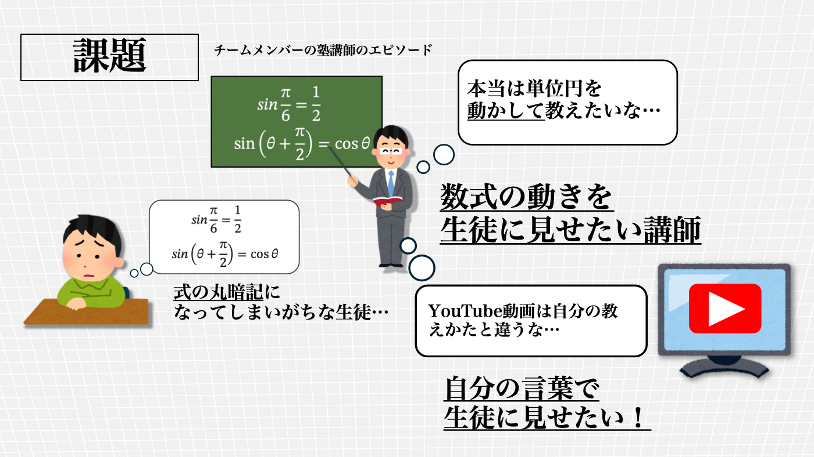

# SUDO - 数学動画ジェネレーター -

## 製品概要

**数学教育 X Tech**: 生徒に数式の"動き"を伝えたい数学講師が、即座にオリジナル解説動画を作れる動画ジェネレーター

### 製品開発のきっかけ

塾の数学の講師をしている中で、数式の意味を教えたいのに生徒が数式の意味を丸暗記してしまい、式の意味を理解していない生徒をたくさん見てきました。

そこで私のような**学校や塾で「自分らしい解説」を動画で手軽に届けたい」数学講師**が簡単に副教材としてのアニメーションを作れるアプリケーションを作りたいと考えました！

#### 課題感
<!-- ここにスライド貼り付け -->

<!-- youtube動画 -->
#### 紹介動画

#### 従来教材・動画教材の限界

- 紙のプリントや黒板、静止画像教材では、図形の変形や関数の動きを直感的に伝えられない。
- YouTube動画教材は生徒にとっての「その場」の疑問とずれていることもある。
  - また講師が本当に教えたい内容や重点と違う場面が多々あり、指導現場でも不適切なケースが発生しやすい。

- また、[スタディサプリの学習塾市場から撤退](https://www.shijyukukai.jp/2025/09/28730)が示すように動画教材が「サービス自体のカスタマイズ性不足」「塾ごとの指導方針やカリキュラムに柔軟に対応できない」という課題が学習市場である。
- 加えてSora2など現在の動画生成AIツールでは、教育用・数学専用のアニメーション、数式変形の過程や根拠を表現する細かなカスタマイズが難しく、現場の課題にフィットしない。
- つまり **「動的な可視化」と「細やかな個別カスタマイズ」を同時に実現する“教育現場で使用できるツール”が決定的に不足している。**

#### 解決の方向性

- **生徒が「公式や答えの暗記」で終わらないよう、教師は数式や関数・図形の“動き”や“なぜそうなるか”の根拠をアニメーション動画で直感的に伝えられるようにする。**
- **教師・塾講師が、生徒ごと・授業ごとの“その場”の疑問や理解度に合わせて、オリジナルの解説動画を簡単・即時に作れるようにする。**
- **manimとAIによる自動生成・編集機能で、従来は専門知識や長時間が必要だった教材（動画）作成のハードルを劇的に下げる。**
- **動画生成・編集の工程をすべて直感的なUIで完結させ、誰でも現場のニーズに合わせた数学教材を手軽に作れる環境を提供する。**

### 製品説明

**SUDO**は、数学講師が「自分らしい解説」をするための**数学動画ジェネレーター**です。

- **誰のため？**
  - 学校や塾の数学講師、「自分らしい解説」を動画で手軽に届けたい先生

- **何ができる？**
  - 手元の数式や板書イメージをテキストで入力すれば、**AI×manimが解説意図に沿った理想の数学動画を即自動生成**
  - 先生自身の“教えたい順序”“強調したいポイント”“生徒のつまずきや質問”を、自然な日本語で柔軟に動画へ反映できる

- **どう使える？**
  - 授業で「説明が難しい」「紙だと伝わらない」単元を、すぐ動画でビジュアル化
  - テスト後や質問対応で、生徒ごとに「分からなかった箇所」だけピンポイントで作り直し、個別で教材作成
  - 自分だけの“補助教材”動画が何本でも作れる

- **どこが新しい？**
  - 先生一人ひとりの「現場の工夫」「説明のこだわり」が**そのまま“動画”という形で即反映**できる
  - 従来の生成AIでは難しかった、**数式や教材内容を“自然言語で指示するだけ”で、動的な数学アニメーション動画へ自動変換**できる
  - **指導意図・を強調したいといった要望も満たせる**ので、教師主導の現場適応性が圧倒的に高い
  - 数学特化AI＋manim連携というアーキテクチャにより、**LaTeXや自然文・教材テキストから複雑な数式アニメ作成をで自動化**。
  - Sora2とは異なり、数学全般の動画に特化している。

### 解決できること

- 教師は自分の教えたい通りに数学動画を即生成し、指導を効率化できる
- 生徒はわかりにくい数式の意味や動きを、直感的な動画で理解できる

## 技術

### 独自技術

**Manim動画生成AIエージェント**

LangGraphベースのAIエージェントにより動画を生成しています。これはコード生成やエラー処理、実行を頂点に持ち、コードやエラー内容を状態として保持しています。

**Manim専用linter**

Manim 0.19.0で使用できないクラス／メソッド／引数の有無を静的解析で確認する自作のlinterを開発しました。

**検索機能**

既存動画の説明文を埋め込みベクトル化してベクトルDBに保存し、ユーザー入力に意味的に近い動画を高速に検索できるようにしています。

**実行前セキュリティチェック**

プロンプトインジェクション対策として、Manim コード実行前に危険なコードでないかをを静的解析により確認しています。

**コードの差分更新**

編集時やエラー処理時に Unified Diff 形式の差分更新を適用し、出力トークン削減による低コスト化と高速化を実現しています。

**セキュリティに対する意識**

HTTPS 化・Docker 利用・GitHub コードレビューの厳格化により、安全なコード実行環境を整備しました。

### フレームワーク・ライブラリ・モジュール
* **Next.js**: フロントエンドフレームワーク
* **manim**: 数学動画生成エンジン
* **FastAPI**: バックエンドAPIフレームワーク
* **langchain/LangGraph** LLM エージェント
* **ast** 抽象構文木作成
* **Gemini API**: プロンプト生成とmanimコード自動生成のためのLLM
* **Chroma**  RAG用DB
